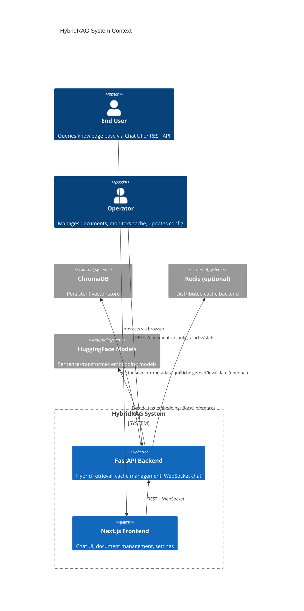
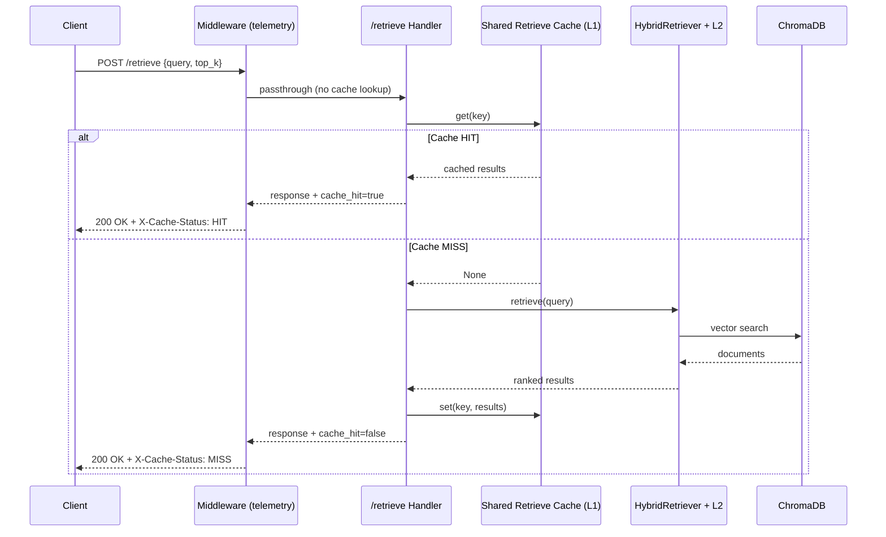
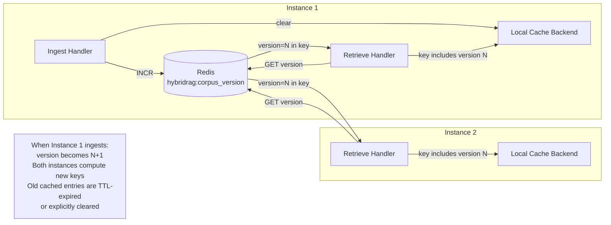
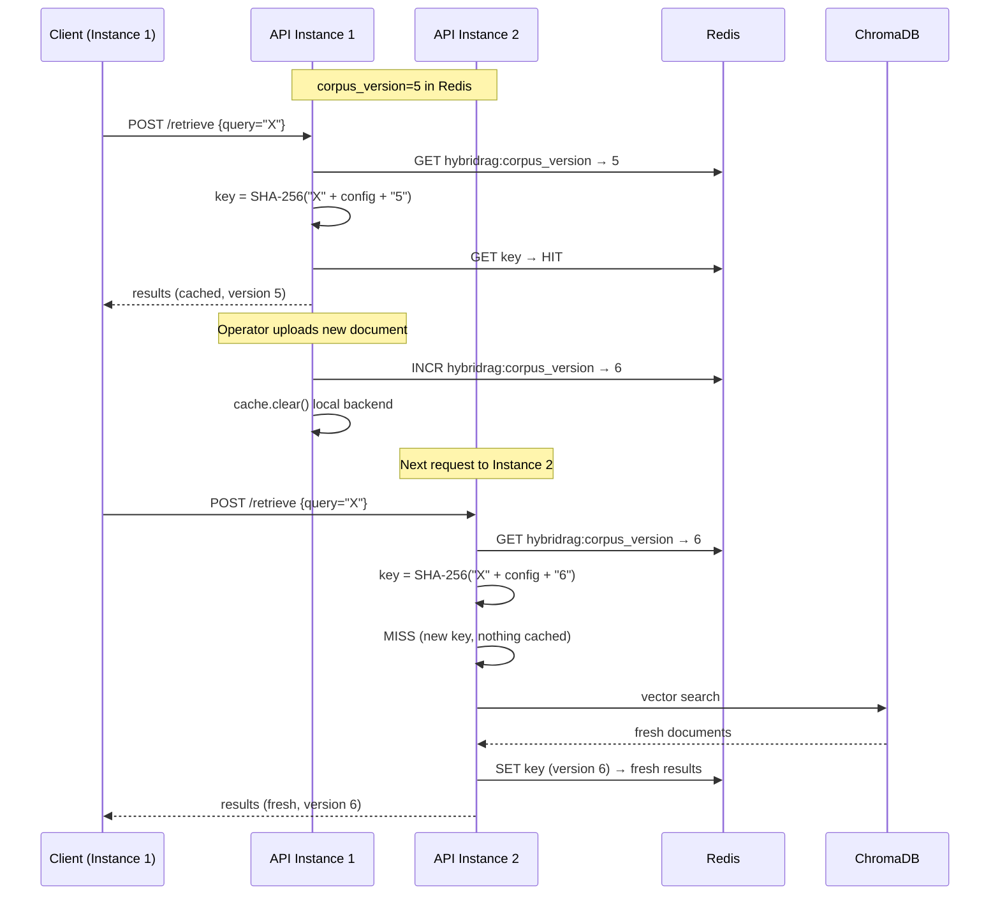
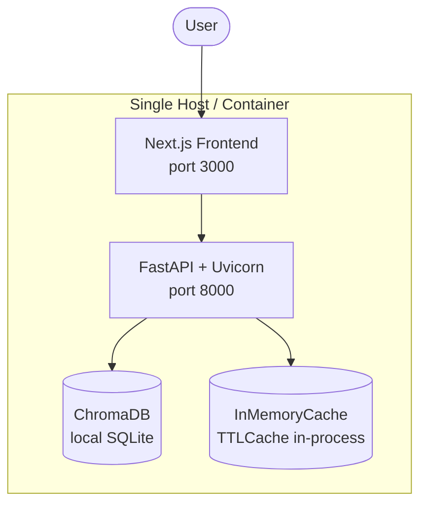
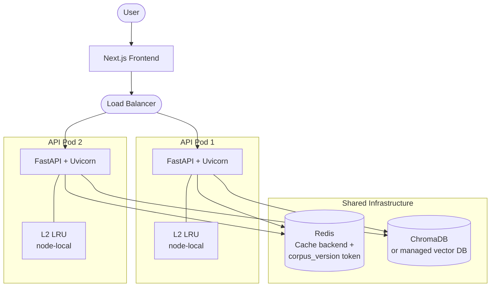
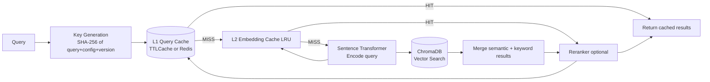
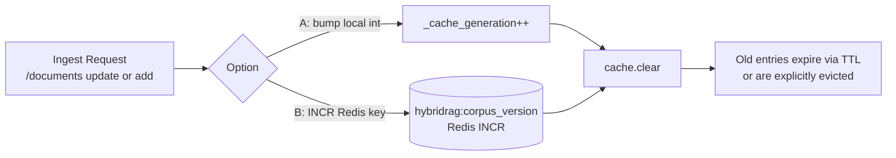
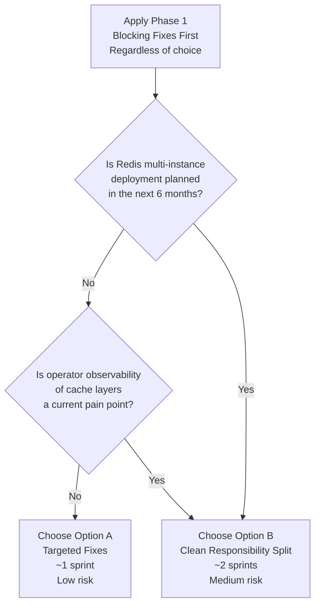

# HybridRAG — Cache Simplification Architecture Blueprint

> **Scope:** Cache layer simplification only. This document addresses the blocking findings from the cache critique (ttl_seconds=0 in stats, process-local invalidation token, double-caching overlap) and the complexity findings from the simplification research. It does **not** redesign the retrieval, embedding, or frontend layers.
>
> **Inputs:** gem-critic findings (2 blocking, 5 warnings), gem-researcher stale-data risk analysis, live codebase exploration (api.py, api_middleware.py, hybrid_rag/cache.py, hybrid_rag/retriever.py).

---

## Executive Summary

The Hybrid RAG system currently runs a three-layer cache stack: an ASGI response-level middleware (L1-M), a shared result-level retrieval cache (L1-R), and a node-local LRU embedding cache (L2). The middleware and shared retrieval cache serve **overlapping purposes** on the same endpoint (`POST /retrieve`), use **different key-identity contracts**, and expose **conflicting observability** (one reports X-Cache headers, the other does not). A process-local invalidation counter makes multi-instance Redis deployments incoherent by design.

Two simplification paths are viable:

| | **Option A — Targeted Fixes** | **Option B — Clean Responsibility Split** |
|---|---|---|
| Risk | Low | Medium |
| Effort | ~1 sprint | ~2 sprints |
| Solves distributed coherency | No (deferred) | Yes |
| Architectural cleanliness | Moderate | High |
| Test surface delta | Small | Moderate |

Both options preserve the L2 embedding LRU and the pluggable `CacheBackend` abstraction.

---

## System Context

### Diagram



### Context Notes

- **ChromaDB** is the corpus source of truth. Cache invalidation is always triggered by changes here (via `/documents` ingest endpoints).
- **Redis** is an optional distributed backend; without it, cache is in-process `TTLCache`. This distinction is central to both architecture options.
- The **frontend** has no server-side API cache — it persists chat history to `localStorage` via Zustand only. This is out of scope.

---

## Current State Architecture (As-Is)

### As-Is Cache Layer Diagram

```mermaid
flowchart TD
    Client([Client: REST or WebSocket])

    subgraph ASGI Stack
        direction TB
        MW[L1-M: QueryCacheMiddleware\nASGI response bytes cache\nKey: SHA-256 canonical JSON body\nBacked by CacheBackend]
    end

    subgraph FastAPI App
        direction TB
        RH[POST /retrieve handler]
        WS[WebSocket /ws/chat handler]
        SRC[_shared_retrieve_documents\nL1-R: Result-level cache\nKey: SHA-256 query + config + corpus_version\nBacked by CacheBackend]
        INV[Invalidation\n_cache_generation int\nPROCESS-LOCAL]
        ING[/documents ingest]
    end

    subgraph HybridRetriever
        direction TB
        L2[L2: LRU Embedding Cache\ncachetools.LRUCache maxsize=5000\nNO lock, NO TTL, NO invalidation API]
    end

    CB[(CacheBackend\nInMemoryCache or RedisCache)]
    CDB[(ChromaDB)]

    Client -->|POST /retrieve| MW
    MW -->|Cache MISS| RH
    MW -->|Cache HIT| Client
    RH --> SRC
    WS --> SRC
    SRC -->|Cache MISS| L2
    L2 -->|Embed| CDB
    ING -->|update: bumps _cache_generation + clears cache| INV
    ING -->|add: NO cache clear| INV
    MW --- CB
    SRC --- CB

    style MW fill:#f9c,stroke:#c00,color:#000
    style SRC fill:#ffd,stroke:#aa0,color:#000
    style L2 fill:#ddf,stroke:#00a,color:#000
    style INV fill:#fcc,stroke:#c00,color:#000
```

### Identified Problems (As-Is)

| # | Severity | Problem | Location |
|---|---|---|---|
| B1 | **BLOCKING** | `/cache/stats` reports `ttl_seconds: 0` — backends don't emit this field, api.py falls back to `dict.get("ttl_seconds", 0)` | `cache.py:308`, `cache.py:543`, `api.py:917` |
| B2 | **BLOCKING** | `_cache_generation` is process-local int. Multi-instance Redis deployments get divergent invalidation tokens — one pod invalidates, others keep serving stale results | `api.py:78`, `api.py:497` |
| W1 | Warning | Double-caching on `POST /retrieve`: middleware stores raw HTTP response bytes + shared retrieval stores parsed results. Two different key contracts on the same logical query | `api_middleware.py:262`, `api.py:499` |
| W2 | Warning | `ingest_type=add` preserves cache entirely despite corpus growing. Stale semantic search guaranteed until TTL expiry | `api.py:1191` |
| W3 | Warning | No per-layer metrics. L2 stats invisible to operators. WebSocket path has no X-Cache analogue | `api.py:917`, `retriever.py:89` |
| W4 | Warning | L2 embedding cache has no thread lock, no TTL, no invalidation path | `retriever.py:89` |
| W5 | Warning | Integration test placeholders (`pass`) at lines 371, 400, 442, 448, 454, 499 | `test_cache_integration.py` |

---

## Architecture Option A — Targeted Fixes

> **Philosophy:** Fix the two blocking issues and the double-caching redundancy with surgical, low-risk changes. The middleware is demoted to a pure telemetry/passthrough layer; the shared retrieval cache becomes the single data cache. Distributed coherency is deferred.

### Option A Component Diagram

```mermaid
flowchart TD
    Client([Client: REST or WebSocket])

    subgraph ASGI Stack
        direction TB
        MW_A[QueryCacheMiddleware\nTELEMETRY ONLY\nAdds X-Cache-Status header\nDoes NOT read/write cache data\nPasses all requests through]
    end

    subgraph FastAPI App
        direction TB
        RH_A[POST /retrieve handler]
        WS_A[WebSocket /ws/chat handler]
        SRC_A[_shared_retrieve_documents\nSINGLE L1 Cache\nKey: SHA-256 query+config+corpus_version\nBacked by CacheBackend]
        INV_A[Invalidation\n_cache_generation int\nStill process-local\nADDS also clears cache]
        ING_A[/documents ingest\nboth update AND add\nclear cache]
    end

    subgraph HybridRetriever
        direction TB
        L2_A[L2: LRU Embedding Cache\nUnchanged\nDocumented as node-local\nno cross-instance guarantee]
    end

    CB_A[(CacheBackend\nInMemoryCache or RedisCache\nStats now include ttl_seconds)]
    CDB_A[(ChromaDB)]

    Client -->|POST /retrieve| MW_A
    MW_A -->|Always passes through| RH_A
    MW_A -->|Sets X-Cache-Status header from response| Client
    RH_A --> SRC_A
    WS_A --> SRC_A
    SRC_A -->|Cache MISS| L2_A
    L2_A -->|Embed| CDB_A
    ING_A -->|update OR add: always bumps + clears| INV_A
    SRC_A --- CB_A

    style MW_A fill:#eee,stroke:#999,color:#000
    style SRC_A fill:#bfb,stroke:#060,color:#000
    style L2_A fill:#ddf,stroke:#00a,color:#000
    style INV_A fill:#ffd,stroke:#aa0,color:#000
```

### Option A Changes

| Change | Rationale | Risk |
|---|---|---|
| Strip `cache.get/set` from `QueryCacheMiddleware.dispatch()` | Eliminates double-caching and key-identity mismatch | Low — middleware tests update |
| Middleware becomes header-injection only (reads `X-Cache-Status` from response context) | Preserves observability without data duplication | Low |
| `InMemoryCache.stats()` and `RedisCache.stats()` emit `ttl_seconds` | Fixes B1, makes `/cache/stats` truthful | Low — additive change |
| `ingest_type=add` path calls `cache.clear()` and bumps `_cache_generation` | Fixes W2, eliminates guaranteed stale-on-add scenario | Low — one-line change in ingest handler |
| Document L2 as "node-local, best-effort, no cross-instance guarantee" in README | Acknowledges scope without code change | None |

### Option A Sequence Diagram (POST /retrieve, simplified)



### Option A Trade-Off Analysis

| Dimension | Pro | Con |
|---|---|---|
| **Complexity** | Eliminates one full caching path. Single mental model for engineers | Middleware class still exists as a thin wrapper — may confuse future maintainers |
| **Performance** | Removes one cache lookup and one serialization per L1 hit | No meaningful regression — shared retrieval cache is already fast |
| **Distributed coherency** | Not addressed | `_cache_generation` remains process-local. Multi-instance Redis still risks divergent invalidation. This is a **known, deferred risk** |
| **Observability** | Fixes ttl_seconds=0. Single cache stats source of truth | L2 embedding stats still not surfaced in `/cache/stats` |
| **Migration risk** | All existing middleware tests require update, not deletion | Requires careful regression testing on the 47 middleware tests |
| **Time to implement** | ~1 sprint (3–5 days) | — |
| **When to choose** | Single-instance deployments; teams wanting low-risk incremental improvement | Not suitable if Redis multi-instance is on the roadmap in <6 months |

---

## Architecture Option B — Clean Responsibility Split

> **Philosophy:** Assign each cache layer an unambiguous, non-overlapping contract. The middleware becomes purely an observability/rate-limit layer. The shared retrieval cache becomes the authoritative L1 query cache with a **distributed invalidation token** (Redis atomic counter) to solve multi-instance coherency. The L2 embedding cache gets an explicit "node-local, no invalidation" contract and is surfaced in stats.

### Option B Component Diagram

```mermaid
flowchart TD
    Client([Client: REST or WebSocket])

    subgraph ASGI Stack
        direction TB
        MW_B[Observability Middleware\nRequest logging\nRate-limit headers\nCorrelation ID injection\nNO cache data read/write]
    end

    subgraph FastAPI App
        direction TB
        RH_B[POST /retrieve handler]
        WS_B[WebSocket /ws/chat handler]
        SRC_B[_shared_retrieve_documents\nL1-R: Authoritative Query Cache\nKey: SHA-256 query+config+corpus_version\nBacked by CacheBackend]
        INV_B[Distributed Invalidation Token\n_get_corpus_version fetches from Redis\nRedis key: hybridrag:corpus_version\nAtomic INCR on every ingest]
        ING_B[/documents ingest\nall types call INCR on version key\nthen cache.clear on local backend]
        STATS_B[/cache/stats\nLayered response\nl1_query + l2_embedding + backend_health]
    end

    subgraph HybridRetriever
        direction TB
        L2_B[L2: LRU Embedding Cache\ncachetools.LRUCache\nThreadsafe RLock wrapper added\nExposes hit/miss via stats property\nNode-local explicit contract]
    end

    REDIS_B[(Redis\nCache backend + version token\nhybridrag:corpus_version)]
    CDB_B[(ChromaDB)]
    INMEM_B[(InMemoryCache\nfallback if Redis unavailable)]

    Client -->|POST /retrieve| MW_B
    MW_B -->|Always passthrough| RH_B
    RH_B --> SRC_B
    WS_B --> SRC_B
    SRC_B -->|Cache MISS| L2_B
    L2_B -->|Embed| CDB_B
    ING_B -->|INCR hybridrag:corpus_version| REDIS_B
    ING_B -->|clear local backend cache| SRC_B
    SRC_B --- REDIS_B
    SRC_B -.->|fallback| INMEM_B
    STATS_B -->|query| SRC_B
    STATS_B -->|query| L2_B

    style MW_B fill:#eee,stroke:#999,color:#000
    style SRC_B fill:#bfb,stroke:#060,color:#000
    style L2_B fill:#bdf,stroke:#00a,color:#000
    style INV_B fill:#bfb,stroke:#060,color:#000
    style STATS_B fill:#bff,stroke:#099,color:#000
```

### Option B — Distributed Invalidation Flow



**How distributed invalidation works:**
1. `hybridrag:corpus_version` is a Redis integer key, initialized to `0`.
2. On every ingest (both `update` and `add`), the ingest handler calls `INCR hybridrag:corpus_version` atomically.
3. `_shared_retrieve_documents` calls `GET hybridrag:corpus_version` before building the cache key — all instances see the same version number.
4. After a version bump, all instances compute a new cache key for the same query, effectively invalidating stale results without a `FLUSHDB`.
5. Old entries expire naturally via TTL (no explicit cross-instance `clear()` needed for multi-instance coherency).
6. Fallback: if Redis is unreachable, fall back to local `_cache_generation` int (fail-open, existing behavior).

### Option B — Layered `/cache/stats` Response

```mermaid
flowchart LR
    STATS[GET /cache/stats]
    L1[l1_query_cache\n- backend: memory|redis\n- size / max_size\n- hits / misses\n- hit_rate\n- ttl_seconds\n- corpus_version]
    L2S[l2_embedding_cache\n- backend: node-local LRU\n- size / max_size\n- hits / misses\n- hit_rate\n- scope: node-local]
    BH[backend_health\n- redis_connected: bool\n- redis_latency_ms: float\n- fallback_active: bool]

    STATS --> L1
    STATS --> L2S
    STATS --> BH
```

### Option B Changes

| Change | Rationale | Risk |
|---|---|---|
| Remove `cache.get/set` from `QueryCacheMiddleware` (same as Option A) | Eliminates double-caching | Low |
| Replace process-local `_cache_generation` with Redis `INCR` on `hybridrag:corpus_version` | Fixes B2, enables multi-instance coherency | Medium — new Redis dependency for invalidation path |
| Add `_get_corpus_version()` with fail-open fallback to local int | Keeps single-instance deployments working without Redis | Low |
| `InMemoryCache.stats()` and `RedisCache.stats()` emit `ttl_seconds` | Fixes B1 | Low |
| Add `threading.RLock` to L2 `_embedding_cache` access | Fixes W4, prevents data races under concurrent load | Low — contained in retriever |
| Expose L2 stats via `HybridRetriever.embedding_cache_stats()` property | Fixes W3 for L2 | Low |
| Refactor `/cache/stats` to return layered `{l1_query_cache, l2_embedding_cache, backend_health}` | Operator visibility; fixes W3 | Medium — API contract change, update API clients |
| `ingest_type=add` always bumps version + clears | Fixes W2 | Low |

### Option B Sequence Diagram (Multi-Instance Retrieve + Invalidate)



### Option B Trade-Off Analysis

| Dimension | Pro | Con |
|---|---|---|
| **Complexity** | Single, unambiguous cache layer per concern. Middleware does observability, L1 does query caching, L2 does embedding caching. Clear ownership | More moving parts during migration: new Redis key contract, new stats schema, new `_get_corpus_version` function |
| **Distributed coherency** | Fully solved for multi-instance Redis deployments. All instances share the same version token | Adds a Redis read on every cache key construction. Adds ~1ms latency on cache miss paths (Redis round-trip is already paid on cache hit) |
| **Observability** | `/cache/stats` is fully layered with L1, L2, and backend health. Operators can monitor each layer independently | `/cache/stats` response schema changes — any existing dashboards or API clients must be updated |
| **Performance** | Eliminates double-caching overhead. L2 RLock adds negligible contention under normal load | Redis `GET corpus_version` on every retrieve adds one network hop on MISS path when Redis is the backend |
| **Resilience** | Fail-open fallback for Redis unavailability preserves single-instance behavior | If Redis is temporarily unreachable, corpus_version may lag — stale results possible during Redis outage window |
| **Migration risk** | Clean break makes future changes easier | Larger test surface delta: middleware tests, integration tests, stats schema tests, embedding cache tests all change |
| **Time to implement** | ~2 sprints (7–10 days) | — |
| **When to choose** | Teams planning multi-instance or container-orchestrated deployments; teams wanting production-grade observability | Not justified if the deployment is permanently single-instance |

---

## Deployment Architecture

### Single-Instance (Option A sufficient)



### Multi-Instance with Redis (Option B required for coherency)



**Deployment notes:**
- L2 embedding caches are intentionally **node-local** — they don't need Redis. Each pod builds its own embedding LRU warm-up from real traffic.
- ChromaDB in multi-instance requires a shared persistent volume or migration to a managed vector store (e.g., Qdrant, Weaviate, Pinecone). This is out of scope for cache simplification.
- Redis sentinel or cluster recommended for production HA; the existing `RedisCache` implementation supports standard Redis connection pools.

---

## Data Flow

### Cache-Hit Data Flow



### Cache Invalidation Data Flow



---

## Non-Functional Requirements Analysis

### Scalability

| Layer | Option A | Option B |
|---|---|---|
| L1 Query Cache | InMemoryCache: single-instance only. RedisCache: horizontally scalable but **invalidation is incoherent** across pods | InMemoryCache: single-instance. RedisCache: **coherent** across pods via atomic version token |
| L2 Embedding Cache | Node-local LRU, scales with node count naturally | Same, explicitly documented as node-local |
| Cache key space | Grows with unique queries × config variants × corpus versions | Same; version token limits orphaned entries |

### Performance

- **L1 hit latency:** InMemory ~0.1ms; Redis ~1–3ms network round-trip.
- **L2 hit latency:** LRU lookup ~0.01ms; avoids sentence-transformer inference (~10–50ms per query).
- **Option B corpus_version fetch:** adds one Redis `GET` per request on the MISS path (~1ms). Acceptable given inference cost savings.
- **Double-caching removal (both options):** eliminates one redundant serialization/deserialization cycle per L1 hit.

### Security

- Cache keys are SHA-256 hashes — no user data is embedded in cache key strings.
- Redis connection uses existing `CacheSettings` TLS + password enforcement in production.
- The `hybridrag:corpus_version` Redis key requires no new permissions beyond existing cache read/write.
- No PII flows through the cache layer (queries are hashed, results contain document chunks without user identity).

### Reliability

| Scenario | Option A | Option B |
|---|---|---|
| Redis unavailable | Cache degrades to InMemory (existing fail-open) | Cache degrades to InMemory + `_cache_generation` fallback (explicit fail-open) |
| Pod restart | InMemory cache cold-starts, Redis cache survives | Same + Redis version token survives pod restart |
| Multi-pod ingest race | Potential brief stale window per pod (unaddressed) | Atomic INCR prevents divergent version state |
| TTL expiry | Entries expire correctly (post B1 fix) | Same |

### Maintainability

- **Option A:** Removes one code path (middleware cache data). Existing test suite updates are bounded.
- **Option B:** Introduces `_get_corpus_version()` abstraction that isolates the Redis/local fallback decision. `/cache/stats` layered schema makes debugging straightforward. More initial complexity, but cleaner long-term.

---

## Phased Migration Path

### Phase 1 — Blocking Fixes (Both Options, 1 week)

Apply regardless of which option is chosen. These are safe, additive, and unblock production observability.

1. **Fix B1:** Add `ttl_seconds` to `InMemoryCache.stats()` and `RedisCache.stats()` return dicts.
2. **Fix W2:** Add `cache.clear()` + generation bump to `ingest_type=add` branch in `api.py`.
3. **Remove placeholder `pass` tests** in `test_cache_integration.py` — replace with real assertions or delete the test skeleton.

### Phase 2 — Cache Path Simplification (Choose Option A or B, 1–2 weeks)

**If choosing Option A:**
4. Strip `cache.get()`/`cache.set()` from `QueryCacheMiddleware.dispatch()`.
5. Update middleware to inject `X-Cache-Status` header from a context variable set by the handler.
6. Update 47 middleware tests to remove data-caching assertions; add header-injection assertions.
7. Document L2 as "node-local, no cross-instance invalidation" in code docstring and README.

**If choosing Option B (in addition to Option A steps):**
8. Implement `_get_corpus_version()` with Redis INCR + fail-open fallback.
9. Replace `_cache_generation` global with calls to `_get_corpus_version()` in `_shared_retrieve_documents`.
10. Add `threading.RLock` to L2 embedding cache access in `retriever.py`.
11. Expose `HybridRetriever.embedding_cache_stats()` property.
12. Refactor `/cache/stats` endpoint to return layered response `{l1_query_cache, l2_embedding_cache, backend_health}`.
13. Update integration tests and API client (if any) for new stats schema.

### Phase 3 — Observability Hardening (Optional, 1 week)

14. Add correlation IDs to cache log lines (link request ID to cache HIT/MISS events).
15. Add structured log entries for cache invalidation events (`corpus_version` old → new, `cache.clear()` size before/after).
16. Emit cache metrics to Prometheus/OpenTelemetry if applicable.

---

## Risks and Mitigations

| Risk | Likelihood | Impact | Mitigation |
|---|---|---|---|
| Option B Redis INCR adds latency regression | Low | Low | Benchmark before/after; Redis `GET` is ~1ms vs. ~50ms inference savings |
| Stats schema change breaks existing monitoring | Medium | Medium | Version the `/cache/stats` endpoint or add backward-compat wrapper |
| Middleware test rewrite introduces regression | Low | Medium | Keep old middleware tests as integration tests against the full stack |
| `_get_corpus_version` Redis fallback silently degrades coherency | Medium | Medium | Emit a `WARNING` log event when fallback is active; add health check flag |
| `add` ingest path cache clear causes thundering herd on large corpora | Low | Medium | Stagger invalidation with short jitter, or move to key-based expiry (new version token makes old keys stale without explicit clear) |
| L2 LRU `RLock` contention under high concurrency (Option B) | Very Low | Low | `RLock` is reentrant; embedding computation is the bottleneck, not lock contention |

---

## Technology Stack — No Changes Required

Both options work within the existing technology stack. No new dependencies are required:

| Component | Current | After Option A | After Option B |
|---|---|---|---|
| Cache backend | `cachetools.TTLCache` + `redis-py` | Unchanged | Unchanged + Redis `INCR` (already in `redis-py`) |
| Serialization | `json` in `RedisCache` | Unchanged | Unchanged |
| Key generation | `hashlib.sha256` | Unchanged | Unchanged |
| Lock primitive | `threading.Lock` in `InMemoryCache` | Unchanged | Add `threading.RLock` to L2 only |
| Stats response model | Pydantic `CacheStats` | Add `ttl_seconds` field | Expand to layered Pydantic model |

---

## Decision Summary



**Recommendation:** Apply Phase 1 (blocking fixes) immediately. Choose Option B if the deployment target is containerized/multi-instance; choose Option A if single-instance operation is the medium-term horizon.

---

## Next Steps

| Priority | Action | Owner |
|---|---|---|
| P0 | Fix `ttl_seconds: 0` in cache backend `stats()` methods | Backend engineer |
| P0 | Fix `ingest_type=add` not clearing cache | Backend engineer |
| P0 | Remove/replace placeholder `pass` tests in `test_cache_integration.py` | Backend engineer |
| P1 | Strip data caching from `QueryCacheMiddleware` (Option A or B prerequisite) | Backend engineer |
| P1 | Decide and document Option A vs B based on deployment roadmap | Architect + Team |
| P2 | Implement Option B corpus_version Redis token (if chosen) | Backend engineer |
| P2 | Refactor `/cache/stats` to layered response (if Option B chosen) | Backend engineer |
| P3 | Add correlation IDs and structured cache log events | Backend engineer |
| P3 | Add Prometheus/OpenTelemetry cache metrics | Platform/SRE |
