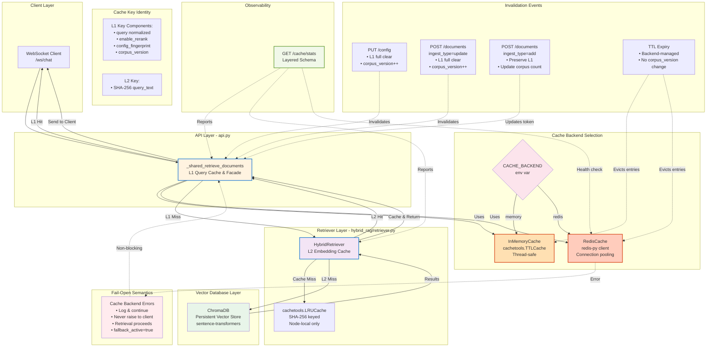

# Hybrid RAG Caching System - Component Flow Diagram

**Document Version:** 1.1
**Last Updated:** 2026-04-24
**Task:** Documentation update and cleanup
**Audience:** Developers, architects, operators

---

## Overview

This diagram visualizes the complete Hybrid RAG caching architecture, showing the flow from client requests through the three-layer cache system to the vector database.

## Component Flow Diagram



---

## Component Descriptions

### Client Layer
- **WebSocket Client**: Real-time streaming via `/ws/chat` (primary retrieval path)

### API Layer (api.py)
- **_shared_retrieve_documents**: Unified retrieval facade with L1 query cache
  - Handles all WebSocket requests from `/ws/chat`
  - Implements L1 query cache at the application layer
  - Manages cache key construction (SHA-256 of normalized query + enable_rerank + config_fingerprint + corpus_version)
  - Implements fail-open semantics (cache failures never block retrieval)
  - Calls the HybridRetriever on cache miss

### Cache Backends
- **InMemoryCache**: Development/single-process deployments
  - Uses `cachetools.TTLCache`
  - Thread-safe with `threading.Lock`
  - Lost on process restart

- **RedisCache**: Production/distributed deployments
  - Connection pooling via redis-py
  - Persistent across restarts
  - Supports multi-instance deployments
  - TLS/auth required in production (SEC-004)

### Retriever Layer (hybrid_rag/retriever.py)
- **HybridRetriever**: Core retrieval engine with L2 embedding cache
  - Always uses in-process `cachetools.LRUCache`
  - Never distributed (by design, ADR-005)
  - Keys: SHA-256(query_text)
  - Thread-safe with `threading.Lock`

### Vector Database Layer
- **ChromaDB**: Persistent vector store (L3)
  - Uses sentence-transformers for embeddings
  - Cosine distance metric
  - Local filesystem persistence

---

## Cache Key Identity

### L1 Query Cache Key
```
SHA-256({
  "query": "<normalized_query_text>",
  "enable_rerank": true|false,
  "config_fingerprint": "<SHA-256 of config>",
  "corpus_version": "gen2.n108"
})
```

### L2 Embedding Cache Key
```
SHA-256(query_text)
```

**Note**: L2 does NOT include config or corpus version because embeddings are model-deterministic and config-independent.

---

## Invalidation Flow

### Event: `PUT /config` (Config Update)
1. Increments `_cache_generation` (process-local counter)
2. Rebuilds `corpus_version` token from ChromaDB
3. Calls `_cache.clear()` to flush L1
4. L2 unaffected (embeddings remain valid)

### Event: `POST /documents` with `ingest_type=update`
1. Increments `_cache_generation`
2. Rebuilds `corpus_version` token
3. Calls `_cache.clear()` to flush L1
4. L2 unaffected

### Event: `POST /documents` with `ingest_type=add`
1. `_cache_generation` NOT incremented
2. Rebuilds `corpus_version` with new document count
3. L1 entries preserved (eventual consistency)
4. L2 unaffected

### Event: TTL Expiry
1. Backend (InMemoryCache or Redis) evicts expired entries
2. No `corpus_version` change
3. No `_cache_generation` change
4. L2 evicts via LRU capacity pressure

---

## Observability

### GET /cache/stats Endpoint
Returns layered schema with:
- **l1_query_cache**: Hits, misses, hit_rate, size, backend, corpus_version
- **l2_embedding_cache**: Hits, misses, hit_rate, size, capacity
- **backend_health**: connected, latency_ms, fallback_active, error
- **timestamp**: ISO-8601 UTC

### X-Cache Response Header
- **HIT**: Served from L1 cache, retriever not called
- **MISS**: Computed fresh and stored in L1
- **ERROR**: Non-200 response, not cached (future enhancement)

### Structured Logging
- **cache.fallback_activated**: WARNING when Redis becomes unreachable
- **cache.fallback_deactivated**: INFO when Redis recovers
- Transition logging prevents log flooding

---

## Fail-Open Behavior

**Principle**: Cache failures never propagate to API consumers.

### Failure Scenarios
1. **Redis connection refused**: `_cache` is None, retrieval proceeds without cache
2. **Redis timeout**: `get()` returns None (cache miss), `set()` logs and continues
3. **Serialization error**: Logged, treated as cache miss
4. **Network partition**: Fail-open, fallback_active=true

### Impact
- ✅ Service remains operational
- ❌ Performance degradation (no cache benefit)
- ❌ Increased compute load and latency

---

## Design Decisions (ADRs)

### ADR-002: enable_rerank in Cache Key
**Decision**: Include per-request `enable_rerank` in L1 cache key identity.
**Rationale**: Requests with different rerank settings produce different results; must be cached separately.

### ADR-005: L2 Always Node-Local
**Decision**: L2 embedding cache never distributed, always in-process LRU.
**Rationale**: Embedding inference is fast (<10ms on CPU); serialization overhead of distributed cache outweighs benefit.

### ADR-007: corpus_version Token Format
**Decision**: `gen{N}.n{count}` where N=generation counter, count=live ChromaDB document count.
**Rationale**: Process-local counter alone lost meaning after restart; including document count grounds the token in DB state.

---

## Multi-Process Considerations

### Worker Isolation
- Each uvicorn worker has independent `_cache_generation` counter
- Each worker has independent L2 embedding cache
- Redis L1 backend is shared across workers
- InMemory L1 backend is NOT shared across workers

### Invalidation in Multi-Worker Setup
- `PUT /config` handled by one worker increments only that worker's counter
- With Redis backend: `clear()` flushes shared cache, affecting all workers
- With InMemory backend: `clear()` affects only the handling worker

### Recommendation
Use `CACHE_BACKEND=redis` for multi-worker production deployments to ensure invalidation is effective across all workers.

---

## Related Documentation

- [CACHING_SEQUENCE.md](./CACHING_SEQUENCE.md) - Detailed sequence diagrams for cache HIT/MISS paths
- [CACHING_ARCHITECTURE.md](../CACHING_ARCHITECTURE.md) - Authoritative architecture reference
- [CACHE_DEPLOYMENT.md](../CACHE_DEPLOYMENT.md) - Deployment procedures and environment variables
- [CACHE_PERF_REPORT.md](../CACHE_PERF_REPORT.md) - Performance benchmarks and test results
- [API_INTEGRATION.md](../API_INTEGRATION.md) - Complete API endpoint documentation

---

**Document Status:** ✅ Current
**Maintained By:** Development Team
**Last Review:** April 24, 2026
