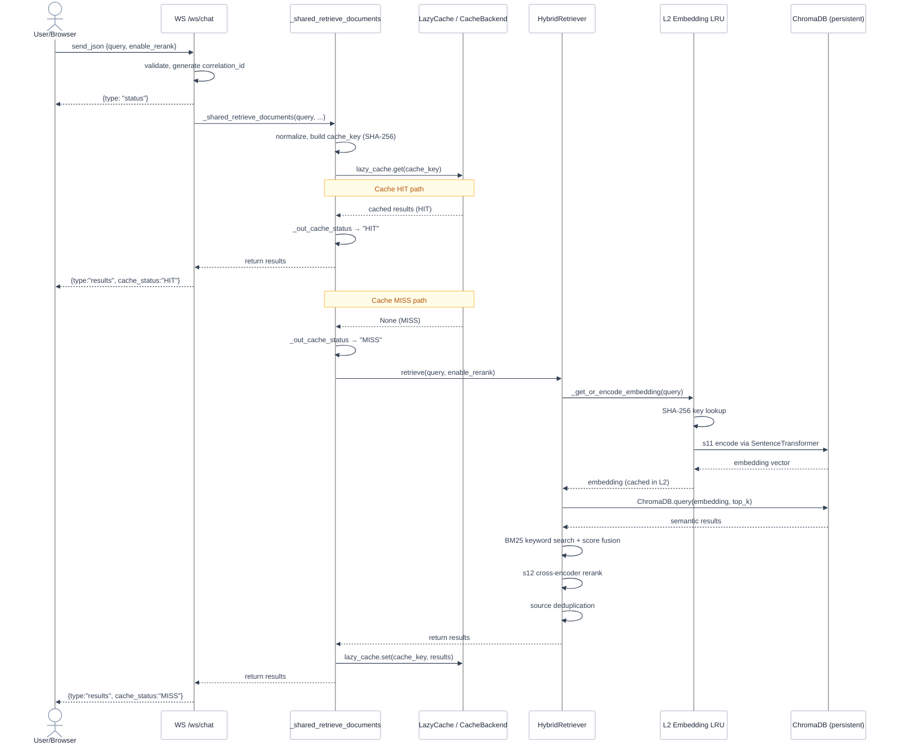
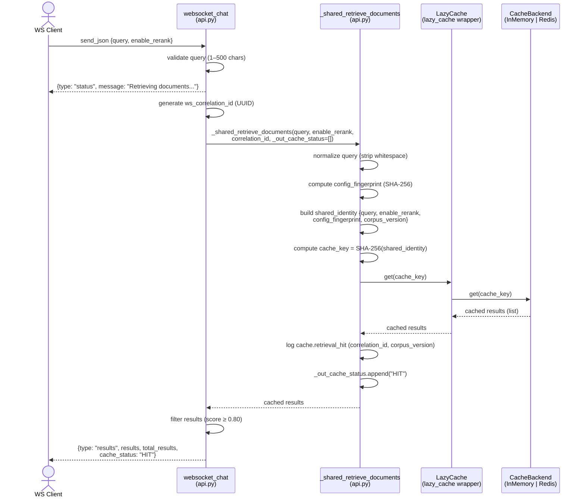
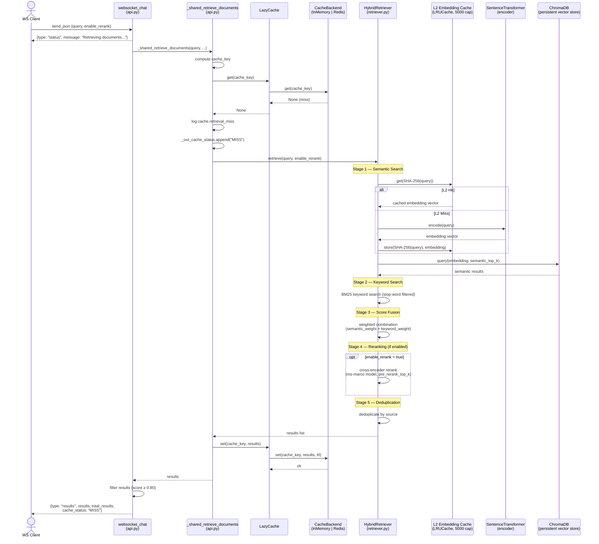
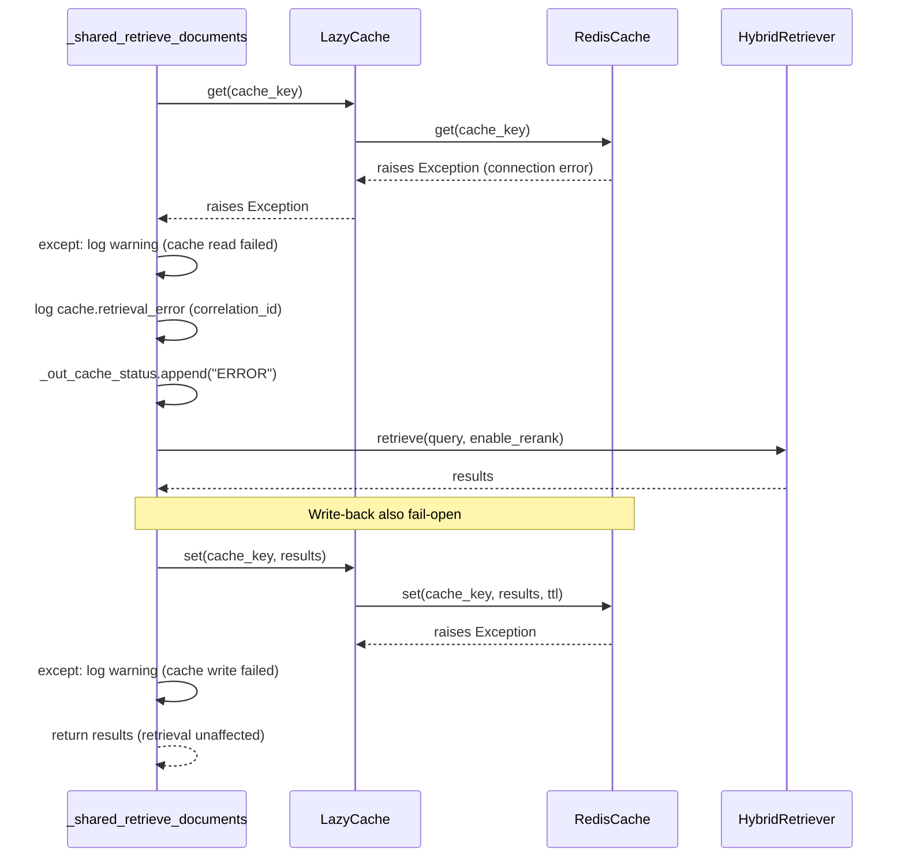
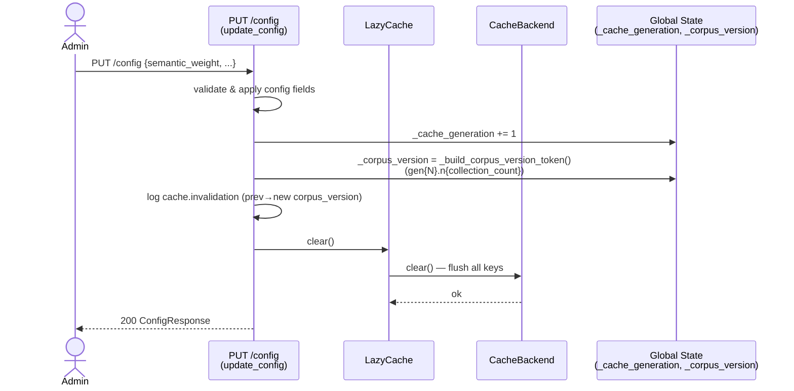
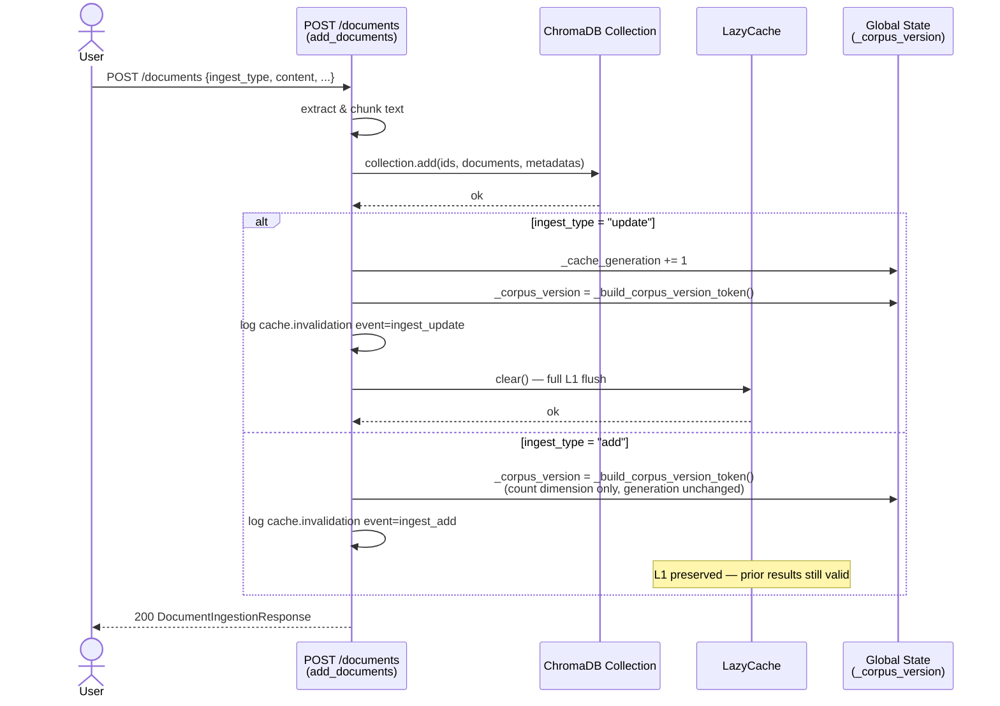
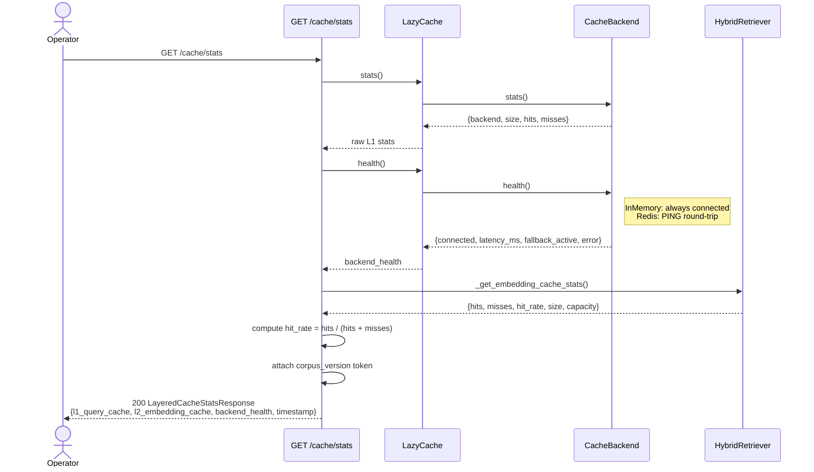

# Hybrid RAG Caching System - Sequence Diagram

**Document Version:** 1.1
**Last Updated:** 2026-04-24

---

## 0. Unified Cache Sequence Flow

> Mirrors [`cache-sequence-flow.svg`](./cache-sequence-flow.svg) exactly — both HIT and MISS branches in a single diagram. Actor colours match the SVG palette.

---

## 1. WebSocket Query — Cache Hit

---

## 2. WebSocket Query — Cache Miss (full retrieval pipeline)

---

## 3. Cache Backend Error — Fail-Open Path

---

## 4. Cache Invalidation — Config Update (`PUT /config`)

---

## 5. Cache Invalidation — Document Ingest (`POST /documents`)

---

## 6. Cache Stats Observability (`GET /cache/stats`)

---

## Cache Key Construction Reference

| Layer | Key Components | Algorithm |
|-------|---------------|-----------|
| L1 (shared retrieval) | `normalized_query` + `effective_enable_rerank` + `config_fingerprint` + `corpus_version` | `SHA-256(JSON(shared_identity))` |
| L2 (embedding) | `query_text` (raw) | `SHA-256(query_text.encode())` |
| `corpus_version` token | `_cache_generation` + `collection.count()` | `"gen{N}.n{count}"` |
