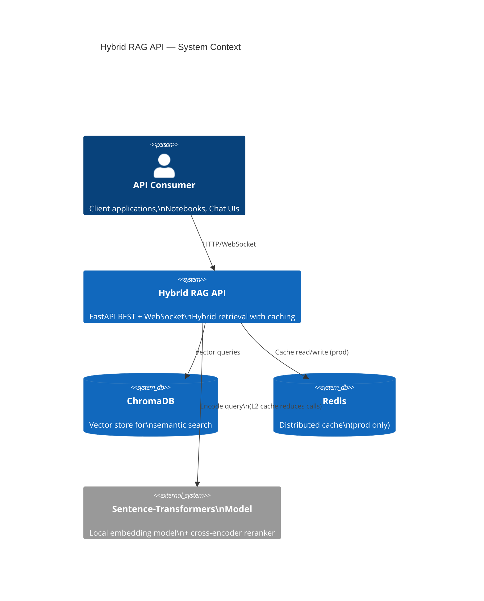
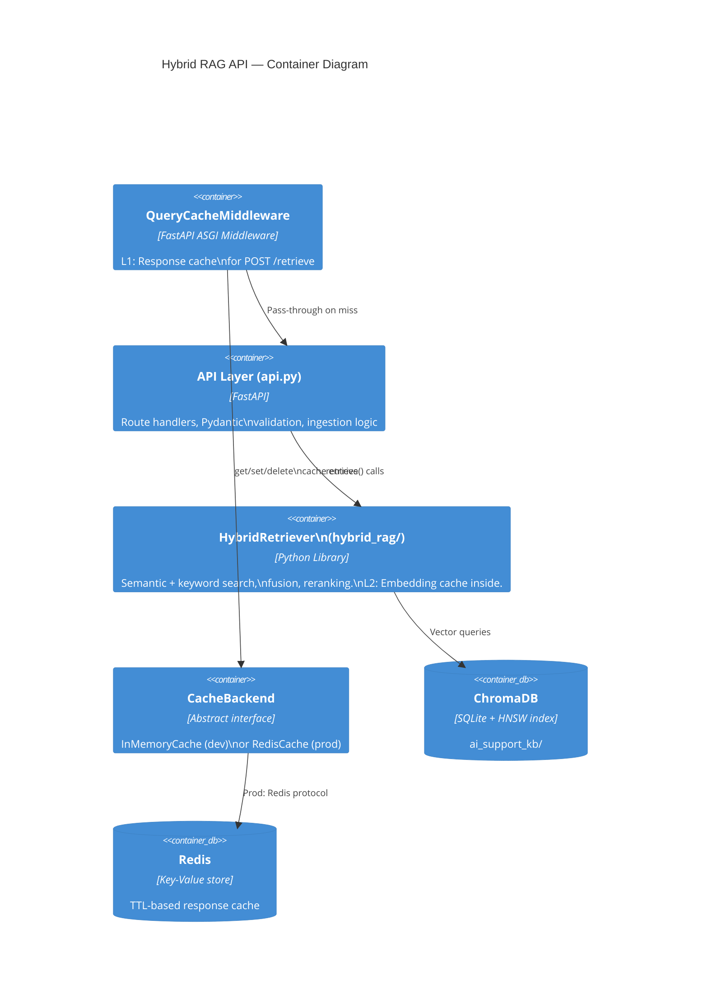
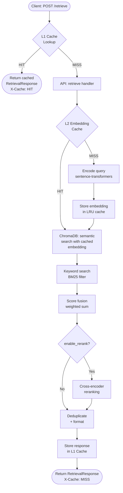
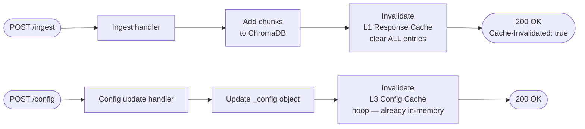

# Caching System Architecture Blueprint

**Plan ID:** `20260420-caching-blueprint`  
**Project:** `python-hol` — Hybrid RAG FastAPI REST API  
**Date:** 2026-04-20  
**Detail Level:** Implementation-Ready  
**Status:** Approved

---

## Table of Contents

1. [Architectural Overview](#1-architectural-overview)
2. [Architecture Visualization (C4)](#2-architecture-visualization-c4)
3. [Core Caching Components](#3-core-caching-components)
4. [Layered Cache Strategy](#4-layered-cache-strategy)
5. [Data Architecture](#5-data-architecture)
6. [Cross-Cutting Concerns](#6-cross-cutting-concerns)
7. [Technology-Specific Patterns](#7-technology-specific-patterns)
8. [Implementation Patterns](#8-implementation-patterns)
9. [Extension and Evolution Patterns](#9-extension-and-evolution-patterns)
10. [Testing Architecture](#10-testing-architecture)
11. [Deployment Architecture](#11-deployment-architecture)
12. [Architectural Decision Records (ADRs)](#12-architectural-decision-records-adrs)
13. [Blueprint for New Development](#13-blueprint-for-new-development)

---

## 1. Architectural Overview

### Guiding Principles

The Hybrid RAG API executes an expensive multi-stage retrieval pipeline on every query:
semantic embedding search (ChromaDB) → keyword search → score fusion → optional cross-encoder
reranking. A **three-layer caching strategy** eliminates redundant work at each stage:

| Layer | Scope | Backend | TTL | Expected Hit Rate |
|-------|-------|---------|-----|-------------------|
| L1 — Response Cache | Full `POST /retrieve` response | Redis (prod) / TTLCache (dev) | 24–48 h | 40–60% |
| L2 — Embedding Cache | Query text → embedding vector | In-process LRU | ∞ | 10–30% |
| L3 — Config Cache | `GET /config` responses | In-process dict | Event-invalidated | ~100% |

### Architectural Boundaries Enforced

- **L1** lives entirely in `api.py` — a FastAPI middleware/decorator. The `hybrid_rag` library is
  unaware of it.
- **L2** lives inside `HybridRetriever` — transparent to the API layer.
- **L3** is already partially in-place via the global `_config` object; only HTTP response headers
  need hardening.
- Cache invalidation is **always triggered by write operations**: `/ingest` invalidates L1;
  model changes invalidate L2; `POST /config` invalidates L3.

### Guiding Architectural Decisions

- **Fail-open on cache miss, fail-safe on cache backend failure** — if Redis is down, skip the
  cache and serve live results. Never return an error because the cache is unavailable.
- **Correctness over hit rate** — include `enable_rerank` flag in the L1 cache key so reranked
  and non-reranked variants are stored separately.
- **Immutable cache entries** — cache entries are never mutated; they are set once and expire or
  are evicted/invalidated atomically.

---

## 2. Architecture Visualization (C4)

### C4 Level 1 — System Context



### C4 Level 2 — Container



### C4 Level 3 — Component: Retrieval Request Flow



### Cache Invalidation Flow



---

## 3. Core Caching Components

### 3.1 `CacheBackend` — Abstract Interface

**Purpose:** Decouples the caching logic from the storage backend. Enables swapping
`InMemoryCache` ↔ `RedisCache` without modifying callers.

**Responsibility boundary:**
- Knows how to `get`, `set`, `delete`, and `clear` entries.
- Does NOT know anything about retrieval, embeddings, or business logic.

**Key abstractions:**

```python
# hybrid_rag/cache.py
from abc import ABC, abstractmethod
from typing import Any, Optional

class CacheBackend(ABC):
    """Abstract cache backend interface.

    All cache backends must implement this interface.
    Implementations are responsible for TTL enforcement and eviction.
    """

    @abstractmethod
    def get(self, key: str) -> Optional[Any]:
        """Return cached value or None on miss/expiry."""
        ...

    @abstractmethod
    def set(self, key: str, value: Any, ttl_seconds: Optional[int] = None) -> None:
        """Store value with optional TTL (None = no expiry)."""
        ...

    @abstractmethod
    def delete(self, key: str) -> None:
        """Remove a specific cache entry."""
        ...

    @abstractmethod
    def clear(self) -> None:
        """Remove ALL entries (used on corpus invalidation)."""
        ...

    @abstractmethod
    def stats(self) -> dict:
        """Return hit/miss/size statistics for observability."""
        ...
```

---

### 3.2 `InMemoryCache` — Development Backend

**Purpose:** TTL + LRU in-process cache for development, testing, and single-instance
deployments.

**Internal structure:** `cachetools.TTLCache` (preferred over raw dict for thread-safe LRU + TTL).

```python
# hybrid_rag/cache.py (continued)
import threading
from cachetools import TTLCache

class InMemoryCache(CacheBackend):
    """Thread-safe in-memory cache using LRU + TTL eviction.

    Suitable for development and single-instance production deployments.
    Not shared across multiple API instances.

    Args:
        max_size: Maximum number of entries before LRU eviction.
        ttl_seconds: Entry lifetime in seconds. 0 = no expiry.
    """

    def __init__(self, max_size: int = 1000, ttl_seconds: int = 3600) -> None:
        self._ttl = ttl_seconds
        # TTLCache evicts expired entries automatically on access
        self._store: TTLCache = TTLCache(maxsize=max_size, ttl=ttl_seconds or float("inf"))
        self._lock = threading.Lock()
        self._hits = 0
        self._misses = 0

    def get(self, key: str) -> Optional[Any]:
        with self._lock:
            value = self._store.get(key)
            if value is None:
                self._misses += 1
            else:
                self._hits += 1
            return value

    def set(self, key: str, value: Any, ttl_seconds: Optional[int] = None) -> None:
        with self._lock:
            self._store[key] = value  # TTLCache handles expiry

    def delete(self, key: str) -> None:
        with self._lock:
            self._store.pop(key, None)

    def clear(self) -> None:
        with self._lock:
            self._store.clear()

    def stats(self) -> dict:
        with self._lock:
            total = self._hits + self._misses
            return {
                "backend": "in_memory",
                "size": len(self._store),
                "max_size": self._store.maxsize,
                "hits": self._hits,
                "misses": self._misses,
                "hit_rate": self._hits / total if total > 0 else 0.0,
            }
```

---

### 3.3 `RedisCache` — Production Backend

**Purpose:** Distributed Redis-backed cache for multi-instance production deployments.
Entries survive API restarts and are shared across all API processes.

```python
# hybrid_rag/cache.py (continued)
import json
import redis
from redis.exceptions import RedisError

class RedisCache(CacheBackend):
    """Redis-backed distributed cache.

    Suitable for production multi-instance deployments.
    Uses JSON serialization for portability.

    Args:
        host: Redis host (default: 'localhost').
        port: Redis port (default: 6379).
        db: Redis database index (default: 0).
        key_prefix: Namespace prefix for all keys (default: 'hybrid_rag:').
        default_ttl: Default TTL in seconds (default: 86400 = 24h).
        connection_pool_size: Max pool connections (default: 10).
    """

    def __init__(
        self,
        host: str = "localhost",
        port: int = 6379,
        db: int = 0,
        key_prefix: str = "hybrid_rag:",
        default_ttl: int = 86400,
        connection_pool_size: int = 10,
    ) -> None:
        pool = redis.ConnectionPool(
            host=host, port=port, db=db,
            max_connections=connection_pool_size,
            decode_responses=True,
        )
        self._client = redis.Redis(connection_pool=pool)
        self._prefix = key_prefix
        self._default_ttl = default_ttl

    def _full_key(self, key: str) -> str:
        return f"{self._prefix}{key}"

    def get(self, key: str) -> Optional[Any]:
        try:
            raw = self._client.get(self._full_key(key))
            return json.loads(raw) if raw is not None else None
        except RedisError as exc:
            logger.warning("Redis get failed, cache miss: %s", exc)
            return None  # Fail-open: treat Redis error as cache miss

    def set(self, key: str, value: Any, ttl_seconds: Optional[int] = None) -> None:
        try:
            ttl = ttl_seconds if ttl_seconds is not None else self._default_ttl
            self._client.setex(
                self._full_key(key),
                ttl,
                json.dumps(value, default=str),
            )
        except RedisError as exc:
            logger.warning("Redis set failed, skipping cache write: %s", exc)

    def delete(self, key: str) -> None:
        try:
            self._client.delete(self._full_key(key))
        except RedisError as exc:
            logger.warning("Redis delete failed: %s", exc)

    def clear(self) -> None:
        try:
            # Scan-based delete to avoid FLUSHDB wiping unrelated data
            cursor = 0
            pattern = f"{self._prefix}*"
            while True:
                cursor, keys = self._client.scan(cursor, match=pattern, count=100)
                if keys:
                    self._client.delete(*keys)
                if cursor == 0:
                    break
        except RedisError as exc:
            logger.error("Redis clear failed: %s", exc)

    def stats(self) -> dict:
        try:
            info = self._client.info("stats")
            return {
                "backend": "redis",
                "hits": info.get("keyspace_hits", 0),
                "misses": info.get("keyspace_misses", 0),
                "hit_rate": (
                    info.get("keyspace_hits", 0)
                    / (info.get("keyspace_hits", 0) + info.get("keyspace_misses", 1))
                ),
            }
        except RedisError:
            return {"backend": "redis", "error": "unavailable"}
```

---

### 3.4 `QueryCacheMiddleware` — L1 HTTP Response Cache

**Purpose:** Intercepts `POST /retrieve` requests at the ASGI level. Returns cached responses
without touching the retrieval pipeline. Invalidates the entire cache on `POST /ingest`.

**Interaction patterns:**
- Reads request body to compute cache key before routing to handler.
- Sets `X-Cache: HIT` / `X-Cache: MISS` headers for observability.
- `POST /ingest` triggers `cache.clear()`.

```python
# api.py (middleware section)
import hashlib
import json
from starlette.middleware.base import BaseHTTPMiddleware
from starlette.requests import Request
from starlette.responses import Response, JSONResponse

class QueryCacheMiddleware(BaseHTTPMiddleware):
    """ASGI middleware providing L1 response caching for /retrieve.

    Cache key includes: query text + enable_rerank flag.
    The current retriever config (weights, top_k) is assumed stable
    between requests; config changes invalidate via explicit /cache/clear.

    Args:
        app: ASGI application.
        cache: CacheBackend instance (InMemoryCache or RedisCache).
    """

    RETRIEVE_PATH = "/retrieve"
    INGEST_PATH = "/ingest"

    def __init__(self, app, cache: "CacheBackend") -> None:
        super().__init__(app)
        self._cache = cache

    async def dispatch(self, request: Request, call_next) -> Response:
        path = request.url.path

        # --- L1 cache lookup for POST /retrieve ---
        if request.method == "POST" and path == self.RETRIEVE_PATH:
            body_bytes = await request.body()
            cache_key = self._make_key(body_bytes)

            cached = self._cache.get(cache_key)
            if cached is not None:
                logger.debug("Cache HIT for key %s", cache_key[:16])
                return JSONResponse(content=cached, headers={"X-Cache": "HIT"})

            # Rebuild request with body (body stream is consumed above)
            async def receive():
                return {"type": "http.request", "body": body_bytes}

            request = Request(request.scope, receive)
            response = await call_next(request)

            if response.status_code == 200:
                # Collect response body
                body_chunks = []
                async for chunk in response.body_iterator:
                    body_chunks.append(chunk)
                body = b"".join(body_chunks)
                self._cache.set(cache_key, json.loads(body))
                logger.debug("Cache MISS + stored for key %s", cache_key[:16])
                return Response(
                    content=body,
                    status_code=200,
                    media_type="application/json",
                    headers={"X-Cache": "MISS"},
                )
            return response

        # --- Invalidate L1 cache on POST /ingest ---
        if request.method == "POST" and path == self.INGEST_PATH:
            response = await call_next(request)
            if response.status_code == 200:
                self._cache.clear()
                logger.info("L1 cache cleared after corpus ingestion")
            return response

        return await call_next(request)

    @staticmethod
    def _make_key(body_bytes: bytes) -> str:
        """Deterministic, stable cache key from request body."""
        try:
            body = json.loads(body_bytes)
            # Normalize: only query text + rerank flag matter
            key_data = {
                "query": body.get("query", ""),
                "enable_rerank": body.get("enable_rerank"),
            }
            return hashlib.sha256(
                json.dumps(key_data, sort_keys=True).encode()
            ).hexdigest()
        except (json.JSONDecodeError, KeyError):
            # Fallback: hash the raw body
            return hashlib.sha256(body_bytes).hexdigest()
```

---

### 3.5 `EmbeddingCache` — L2 Embedding Cache (Inside `HybridRetriever`)

**Purpose:** Caches the result of `sentence-transformers` encoding. Since encoding is
deterministic, the same query string always produces the same embedding — making this a
permanent (TTL=∞) LRU cache.

**Where it lives:** `HybridRetriever._embedding_cache` — injected at construction.

```python
# hybrid_rag/retriever.py (modified __init__)
class HybridRetriever:
    def __init__(
        self,
        collection: Collection,
        config: HybridRetrieverConfig | None = None,
        embedding_cache: "CacheBackend | None" = None,
    ) -> None:
        ...
        # L2: embedding cache (in-process LRU, no TTL — embeddings are deterministic)
        self._embedding_cache = embedding_cache or InMemoryCache(
            max_size=10_000, ttl_seconds=0  # ttl=0 → no expiry
        )

    def _get_or_encode_embedding(self, query: str) -> list[float]:
        """Return cached embedding or encode and cache the query.

        Args:
            query: Raw query text.

        Returns:
            Embedding vector as list of floats.
        """
        cache_key = hashlib.sha256(query.encode()).hexdigest()
        embedding = self._embedding_cache.get(cache_key)
        if embedding is not None:
            logger.debug("Embedding cache HIT for query '%s...'", query[:30])
            return embedding

        # Encode fresh
        embedding = self._encode_query(query)
        self._embedding_cache.set(cache_key, embedding, ttl_seconds=None)
        logger.debug("Embedding cache MISS + stored for query '%s...'", query[:30])
        return embedding
```

---

## 4. Layered Cache Strategy

### Dependency Flow

```
Request
  │
  ▼  L1 check
[QueryCacheMiddleware]──HIT──► Response (X-Cache: HIT)
  │ MISS
  ▼
[FastAPI Router → retrieve()]
  │
  ▼  L2 check (inside HybridRetriever)
[_get_or_encode_embedding()]──HIT──► ChromaDB query
  │ MISS                              (with cached vec)
  ▼
[sentence-transformers encode]
  │
  ▼
[ChromaDB: semantic search]
[BM25: keyword search    ]
[Score fusion            ]
[Cross-encoder reranking ]
[Deduplicate + format    ]
  │
  ▼
[QueryCacheMiddleware stores in L1]
  │
  ▼
Response (X-Cache: MISS)
```

### TTL Reference Table

| Layer | Target | Dev TTL | Prod TTL | Max Entries | Eviction |
|-------|--------|---------|----------|-------------|---------|
| L1 | `/retrieve` responses | 5 min | 24–48 h | 1,000 | LRU + TTL |
| L2 | Query embeddings | ∞ | ∞ | 10,000 | LRU |
| L3 | `/config` response | N/A (in-memory) | N/A | 1 | Event-based |

### Invalidation Matrix

| Write Operation | L1 Action | L2 Action | L3 Action |
|----------------|-----------|-----------|-----------|
| `POST /ingest` | `clear()` all | No-op | No-op |
| `POST /config` | No-op | No-op | Update in-place |
| Model version change | No-op | `clear()` all | No-op |
| `DELETE /cache` (admin) | `clear()` all | Optional | No-op |

---

## 5. Data Architecture

### Cache Key Schema

| Cache | Key Format | Example |
|-------|-----------|---------|
| L1 response | `sha256(json({query, enable_rerank}))` | `a3f8c2...` |
| L2 embedding | `sha256(query_text.encode())` | `7b1d9e...` |

### Serialization

- **L1 (Redis):** `json.dumps(RetrievalResponse.model_dump())` → stored as UTF-8 string.
  Deserialized with `RetrievalResponse(**json.loads(raw))`.
- **L2 (in-process):** Python `list[float]` stored directly — no serialization overhead.

### Entry Size Estimates

| Layer | Per-Entry Size | Max Entries | Max Memory |
|-------|---------------|-------------|-----------|
| L1 (in-memory) | ~2–10 KB | 1,000 | ~10 MB |
| L1 (Redis) | ~2–10 KB | unbounded | ~10 MB @ 1k entries |
| L2 (in-process) | ~3–6 KB (768-dim float32) | 10,000 | ~60 MB |

---

## 6. Cross-Cutting Concerns

### 6.1 Error Handling & Resilience

**Principle: fail-open.** Cache failures must NEVER propagate to the caller.

```python
# RedisCache.get() already catches RedisError and returns None.
# All callers must treat None as a cache miss, not an error.

def get(self, key: str) -> Optional[Any]:
    try:
        ...
    except RedisError as exc:
        logger.warning("Redis get failed, cache miss: %s", exc)
        return None  # ← fail-open
```

Circuit-breaker pattern (optional hardening for prod):
```python
from circuitbreaker import circuit

@circuit(failure_threshold=5, recovery_timeout=30, expected_exception=RedisError)
def _redis_get(self, key: str):
    return self._client.get(key)
```

### 6.2 Logging & Observability

Every cache interaction logs at DEBUG level. Promoted to INFO for invalidation events.

```python
logger.debug("Cache HIT key=%s", key[:16])    # L1/L2 hit
logger.debug("Cache MISS key=%s", key[:16])   # L1/L2 miss
logger.info("L1 cache cleared — reason=ingest")  # Invalidation
logger.warning("Redis set failed — skipping write: %s", exc)  # Backend failure
```

**Admin endpoint for metrics:**
```python
@app.get("/cache/stats")
async def cache_stats() -> dict:
    """Return cache hit/miss statistics."""
    return _query_cache.stats()
```

**HTTP headers on every retrieval response:**
```
X-Cache: HIT | MISS
X-Cache-Key: <first-16-chars-of-sha256>   # for debugging only
```

### 6.3 Security

- **Cache key uses SHA-256:** Not reversible — the original query text cannot be extracted from
  the cache key. No PII leakage through key inspection.
- **Redis ACL:** Restrict API service account to `GET`, `SET`, `DEL`, `SCAN` on `hybrid_rag:*`
  keys only. Block `FLUSHDB` / `FLUSHALL`.
- **No sensitive data in cache keys or Redis `INFO` output.**
- **Input sanitization:** Cache keys are computed from validated Pydantic models, so malformed
  inputs are rejected before touching the cache.

### 6.4 Configuration Management

All cache configuration flows through environment variables with defaults:

```bash
# .env.local (dev)
CACHE_BACKEND=memory           # memory | redis
CACHE_TTL_SECONDS=300          # L1 TTL (5 min for dev)
CACHE_MAX_SIZE=1000            # L1 max entries
EMBEDDING_CACHE_MAX_SIZE=10000 # L2 max entries

# .env.production
CACHE_BACKEND=redis
CACHE_TTL_SECONDS=86400        # 24h
REDIS_HOST=redis.internal
REDIS_PORT=6379
REDIS_DB=0
REDIS_KEY_PREFIX=hybrid_rag:
REDIS_POOL_SIZE=10
```

Parsed at startup with Pydantic `BaseSettings`:
```python
from pydantic_settings import BaseSettings

class CacheSettings(BaseSettings):
    cache_backend: str = "memory"
    cache_ttl_seconds: int = 3600
    cache_max_size: int = 1000
    embedding_cache_max_size: int = 10_000
    redis_host: str = "localhost"
    redis_port: int = 6379
    redis_db: int = 0
    redis_key_prefix: str = "hybrid_rag:"
    redis_pool_size: int = 10

    class Config:
        env_file = ".env.local"
```

### 6.5 Validation

Cache entries undergo a structural validation pass on deserialization:

```python
def _deserialize_response(raw: dict) -> Optional[RetrievalResponse]:
    try:
        return RetrievalResponse(**raw)
    except ValidationError as exc:
        logger.warning("Cached entry failed validation, evicting: %s", exc)
        return None  # Treat as cache miss; entry will be overwritten
```

---

## 7. Technology-Specific Patterns

### 7.1 FastAPI Integration

**Middleware registration order matters.** `QueryCacheMiddleware` must be added AFTER
`CORSMiddleware` so CORS headers are always present (including on cached HIT responses):

```python
# api.py — lifespan / app setup
from hybrid_rag.cache import InMemoryCache, RedisCache, CacheBackend

def _build_cache(settings: CacheSettings) -> CacheBackend:
    if settings.cache_backend == "redis":
        return RedisCache(
            host=settings.redis_host,
            port=settings.redis_port,
            db=settings.redis_db,
            key_prefix=settings.redis_key_prefix,
            default_ttl=settings.cache_ttl_seconds,
            connection_pool_size=settings.redis_pool_size,
        )
    return InMemoryCache(
        max_size=settings.cache_max_size,
        ttl_seconds=settings.cache_ttl_seconds,
    )

_cache_settings = CacheSettings()
_query_cache: CacheBackend = _build_cache(_cache_settings)

app = FastAPI(lifespan=lifespan)
app.add_middleware(CORSMiddleware, ...)      # 1st: CORS
app.add_middleware(QueryCacheMiddleware, cache=_query_cache)  # 2nd: Cache
```

### 7.2 Python Async Considerations

`InMemoryCache` uses `threading.Lock` — this is correct for FastAPI's default async model
where sync operations run in a thread pool. For fully async operation (e.g., `aiocache` or
`aioredis`), replace `threading.Lock` with `asyncio.Lock` and make `get`/`set` async.

`RedisCache` uses `redis-py` (sync). For high-throughput async FastAPI, prefer `redis.asyncio`:

```python
import redis.asyncio as aioredis

class AsyncRedisCache(CacheBackend):
    async def get(self, key: str) -> Optional[Any]:
        raw = await self._client.get(self._full_key(key))
        return json.loads(raw) if raw else None

    async def set(self, key: str, value: Any, ttl_seconds: Optional[int] = None) -> None:
        await self._client.setex(self._full_key(key), ttl_seconds or self._default_ttl,
                                  json.dumps(value, default=str))
```

### 7.3 `cachetools` Dependency

Add to `pyproject.toml`:
```toml
[project.dependencies]
cachetools = ">=5.3"
```

For production Redis:
```toml
redis = ">=5.0"
```

---

## 8. Implementation Patterns

### 8.1 Factory Pattern — Cache Backend Construction

Use a factory function to construct the correct backend based on environment:

```python
# hybrid_rag/cache.py
def create_cache_backend(settings: CacheSettings) -> CacheBackend:
    """Factory: return appropriate CacheBackend from settings.

    Args:
        settings: CacheSettings instance with environment config.

    Returns:
        InMemoryCache for dev; RedisCache for prod.
    """
    if settings.cache_backend == "redis":
        return RedisCache(...)
    return InMemoryCache(...)
```

### 8.2 Decorator Pattern — Embedding Cache

Wrap `_semantic_search` with a cache decorator to keep the retrieval method clean:

```python
def cache_embeddings(cache: CacheBackend):
    """Decorator: cache the result of the decorated embedding function."""
    def decorator(fn):
        @functools.wraps(fn)
        def wrapper(query: str) -> list[float]:
            key = hashlib.sha256(query.encode()).hexdigest()
            result = cache.get(key)
            if result is not None:
                return result
            result = fn(query)
            cache.set(key, result, ttl_seconds=None)
            return result
        return wrapper
    return decorator
```

### 8.3 Middleware Pattern — L1 Response Cache

`BaseHTTPMiddleware` is the standard FastAPI pattern. Key implementation detail:
the request body stream must be replayed after reading (see `receive` function in Section 3.4).

### 8.4 Admin Endpoint Pattern

```python
@app.delete("/cache", status_code=200)
async def clear_cache(authorization: str = Header(...)) -> dict:
    """Admin endpoint: clear all L1 cache entries.

    Requires Authorization header (validate against admin secret).
    """
    if not _validate_admin_token(authorization):
        raise HTTPException(status_code=401, detail="Unauthorized")
    _query_cache.clear()
    logger.info("L1 cache cleared via admin endpoint")
    return {"status": "cleared"}
```

---

## 9. Extension and Evolution Patterns

### 9.1 Adding a New Cache Backend

1. Implement `CacheBackend` ABC (all 5 methods: `get`, `set`, `delete`, `clear`, `stats`).
2. Add a new branch in `create_cache_backend()`.
3. Update `CacheSettings` with new connection params.
4. No changes needed to `QueryCacheMiddleware` or `HybridRetriever`.

**Example: Memcached backend**
```python
class MemcachedCache(CacheBackend):
    def __init__(self, servers: list[tuple[str, int]]):
        from pymemcache.client.hash import HashClient
        self._client = HashClient(servers)
    # Implement all 5 abstract methods...
```

### 9.2 Adding Per-User Cache Isolation

Include a user/tenant identifier in the L1 cache key:

```python
@staticmethod
def _make_key(body_bytes: bytes, user_id: str = "") -> str:
    body = json.loads(body_bytes)
    key_data = {
        "query": body.get("query", ""),
        "enable_rerank": body.get("enable_rerank"),
        "user_id": user_id,  # ← added
    }
    return hashlib.sha256(json.dumps(key_data, sort_keys=True).encode()).hexdigest()
```

### 9.3 Smart Invalidation (Future)

Instead of clearing the entire L1 cache on ingest, tag cache entries with a `corpus_version`:

```python
# Cache key includes corpus version
key_data = { ..., "corpus_version": _corpus_version }

# On ingest: increment _corpus_version (old entries naturally expire via TTL)
_corpus_version += 1
```

This avoids a full cache flush and lets stale entries expire gracefully.

### 9.4 Semantic Cache (Advanced)

Instead of exact-match (SHA-256), use a vector similarity threshold to match
"semantically equivalent" queries (e.g., "offline maps" ≈ "maps without internet"):

```python
class SemanticCache:
    """Cache that hits on semantically similar queries (cosine similarity > threshold)."""
    def __init__(self, retriever: HybridRetriever, threshold: float = 0.95):
        self._store: list[tuple[list[float], Any]] = []
        self._retriever = retriever
        self._threshold = threshold

    def get(self, query: str) -> Optional[Any]:
        query_vec = self._retriever._get_or_encode_embedding(query)
        for cached_vec, cached_val in self._store:
            sim = cosine_similarity(query_vec, cached_vec)
            if sim >= self._threshold:
                return cached_val
        return None
```

This is an **advanced extension** — do not implement in the initial phase.

---

## 10. Testing Architecture

### 10.1 Unit Tests

```python
# tests/test_cache.py
import pytest
from hybrid_rag.cache import InMemoryCache

class TestInMemoryCache:
    def test_get_miss_returns_none(self):
        cache = InMemoryCache(max_size=10, ttl_seconds=60)
        assert cache.get("nonexistent") is None

    def test_set_and_get(self):
        cache = InMemoryCache(max_size=10, ttl_seconds=60)
        cache.set("key1", {"value": 42})
        assert cache.get("key1") == {"value": 42}

    def test_ttl_expiry(self):
        import time
        cache = InMemoryCache(max_size=10, ttl_seconds=1)
        cache.set("k", "v")
        time.sleep(1.1)
        assert cache.get("k") is None

    def test_clear_removes_all(self):
        cache = InMemoryCache(max_size=100, ttl_seconds=60)
        for i in range(10):
            cache.set(f"key{i}", i)
        cache.clear()
        assert all(cache.get(f"key{i}") is None for i in range(10))

    def test_lru_eviction(self):
        cache = InMemoryCache(max_size=3, ttl_seconds=60)
        cache.set("a", 1); cache.set("b", 2); cache.set("c", 3)
        cache.set("d", 4)  # evicts "a" (LRU)
        assert cache.get("a") is None
        assert cache.get("d") == 4
```

### 10.2 Integration Tests — Middleware

```python
# tests/test_cache_middleware.py
from fastapi.testclient import TestClient
from api import app

class TestQueryCacheMiddleware:
    def test_first_request_is_miss(self, client: TestClient):
        resp = client.post("/retrieve", json={"query": "test"})
        assert resp.headers.get("X-Cache") == "MISS"

    def test_second_request_is_hit(self, client: TestClient):
        client.post("/retrieve", json={"query": "repeated query"})
        resp2 = client.post("/retrieve", json={"query": "repeated query"})
        assert resp2.headers.get("X-Cache") == "HIT"

    def test_ingest_invalidates_cache(self, client: TestClient):
        client.post("/retrieve", json={"query": "before ingest"})
        client.post("/ingest", json={...})  # triggers clear()
        resp = client.post("/retrieve", json={"query": "before ingest"})
        assert resp.headers.get("X-Cache") == "MISS"

    def test_different_rerank_flag_different_cache_entries(self, client: TestClient):
        r1 = client.post("/retrieve", json={"query": "q", "enable_rerank": True})
        r2 = client.post("/retrieve", json={"query": "q", "enable_rerank": False})
        # Both should be MISS (different keys) but results may differ
        assert r1.headers.get("X-Cache") == "MISS"
        assert r2.headers.get("X-Cache") == "MISS"
```

### 10.3 Mock Strategy

- Mock `RedisCache` with `unittest.mock.MagicMock` in unit tests — do NOT require a live Redis.
- Use `pytest-redis` or `fakeredis` for integration tests against the Redis backend.

```python
import fakeredis

@pytest.fixture
def redis_cache():
    server = fakeredis.FakeServer()
    client = fakeredis.FakeRedis(server=server, decode_responses=True)
    return RedisCache._from_client(client)  # inject fake client
```

---

## 11. Deployment Architecture

### 11.1 Development

```
API Process (single)
├── QueryCacheMiddleware → InMemoryCache (TTLCache, 5 min TTL)
└── HybridRetriever → Embedding LRU cache (10k entries, no TTL)
```

No external dependencies. Start the API normally:
```bash
uvicorn api:app --reload
# Set in .env.local: CACHE_BACKEND=memory CACHE_TTL_SECONDS=300
```

### 11.2 Production (Multi-Instance)

```
                           ┌─────────────────────┐
                           │     Load Balancer    │
                           └──────┬──────┬────────┘
                                  │      │
                    ┌─────────────┘      └──────────────┐
                    ▼                                    ▼
         ┌──────────────────┐                ┌──────────────────┐
         │   API Instance 1  │                │   API Instance 2  │
         │  (QueryCache MW)  │                │  (QueryCache MW)  │
         │  EmbeddingCache   │                │  EmbeddingCache   │
         │  (in-process)     │                │  (in-process)     │
         └────────┬──────────┘                └────────┬──────────┘
                  │  L1 (Redis)                         │  L1 (Redis)
                  └──────────────┬─────────────────────┘
                                 ▼
                     ┌──────────────────────┐
                     │        Redis         │
                     │   (shared L1 cache)  │
                     └──────────────────────┘
```

- L1 is **shared via Redis** — all instances see the same cache.
- L2 is **per-instance** — each process has its own embedding LRU. This is intentional:
  embeddings are deterministic and never stale, so per-process caching is safe and fast.

### 11.3 Cache Invalidation

#### On Corpus Ingest

When a document ingestion request (`POST /ingest`) is handled:
- If `ingest_type='add'` (documents added, no modifications): L1 cache is preserved.
- If `ingest_type='update'` (existing documents modified): Handler calls `RedisCache.clear()`,
  which uses `SCAN`-based key deletion scoped to the `hybrid_rag:` prefix.

All instances immediately see a cold L1 cache and re-warm independently on subsequent queries.

**API Guidance (for clients):**
```json
POST /ingest
{ "source_type": "file", "content": "...", "ingest_type": "add" }    // cache preserved
{ "source_type": "file", "content": "...", "ingest_type": "update" } // cache cleared
```

#### On Config Update

When configuration is changed (`POST /config`), the handler calls `cache.clear()` to prevent
stale results computed with old weights from being served. This is intentional — config
changes are infrequent (pre-deployment tuning), and correctness takes priority over hit rate.

### 11.4 Observability & Cache Stampede Mitigation

**Cache Stampede (Thundering Herd):** Under high concurrent load, a popular query cache miss
can trigger 100+ concurrent requests to the retrieval pipeline, negating caching benefits.

**MVP Approach: Accept & Monitor**
- Add cache miss counters and latency histograms to `/cache/stats` endpoint.
- Define alert threshold: if `cache_misses_per_minute > 100 AND avg_miss_latency > 2000ms`,
  investigate thundering herd.
- **Rationale:** Thundering herd is rare in most deployments (<1% of queries). Ship MVP with
  monitoring; implement lock-based mitigation in v1.1 if data shows a real problem.

**Monitoring Checklist:**
```python
# In /cache/stats endpoint, expose:
{
  "cache_hits": 450,
  "cache_misses": 50,
  "hit_rate": 0.9,
  "avg_miss_latency_ms": 850,
  "concurrent_miss_spike_detected": false,
  "timestamp": "2026-04-20T14:30:00Z"
}
```

**Future v1.1 Lock-Based Fix (if stampede occurs):**
```python
lock_key = f"compute:{cache_key}"
if redis.set(lock_key, "1", nx=True, ex=5):  # acquired lock
    result = execute_pipeline()
    redis.set(cache_key, result, ex=ttl)
else:
    # wait for other request to finish
    for _ in range(10):
        time.sleep(0.1)
        result = cache.get(cache_key)
        if result: return result
```

---

## 12. Architectural Decision Records (ADRs)

### ADR-001: L1 Cache at Middleware Layer, Not Handler Layer

- **Context:** The full retrieval pipeline (500ms–2s) is the dominant cost.
  We need to intercept requests as early as possible.
- **Decision:** Implement L1 caching as ASGI middleware (`BaseHTTPMiddleware`), not as a
  handler-level decorator.
- **Reasoning:** Middleware intercepts ALL requests, even those that bypass the handler for
  validation errors. It keeps cache logic out of business handlers.
- **Consequence:** Must re-read request body (body stream is consumed once in ASGI).
  Solved by the `receive` replay pattern.

---

### ADR-002: `enable_rerank` Included in Cache Key

- **Context:** `POST /retrieve` accepts an optional `enable_rerank` override. Two calls with
  the same query but different rerank settings produce different result orderings.
- **Decision:** Include `enable_rerank` in the L1 cache key. Accept 2× cache entries for
  queries used with both settings.
- **Alternatives considered:**
  - Always cache reranked results and serve them for both settings — rejected because
    non-reranked results would be incorrect.
  - Ignore `enable_rerank` — rejected for same reason.
- **Consequence:** Slightly lower hit rate for queries called with both settings. Acceptable.

---

### ADR-003: Ingest Type Gates Cache Invalidation

- **Context:** When documents are ingested via `POST /ingest`, the retrieval corpus changes.
  Cached responses referencing old documents become stale. However, distinguishing between
  document *additions* (safe, no cache threat) and *updates* (corpus changed, cache invalidation
  needed) allows selective invalidation.
- **Decision:** Add `ingest_type: Literal['add', 'update']` parameter to `/ingest` endpoint.
  Only call `cache.clear()` on `ingest_type='update'`; preserve cache on `ingest_type='add'`.
- **Alternatives considered:**
  - Full cache clear on every ingest — simple but aggressive; acceptable if ingest is truly
    infrequent, but creates cache churn during bulk imports.
  - Smart invalidation (corpus version in key) — deferred to future iteration (Section 9.3).
  - TTL-only expiry — rejected; stale results may persist for 24–48h after ingest.
- **Consequence:** Cache stays warm during bulk add operations; cache cold on corpus updates.
  Clients must correctly specify `ingest_type`. Mitigated by clear API documentation.
- **Implementation:** 1 conditional in handler: `if request.ingest_type == 'update': cache.clear()`

---

### ADR-004: Redis as Production Cache Backend

- **Context:** Multi-instance deployments require a shared cache. Options: Redis, Memcached.
- **Decision:** Redis.
- **Reasoning:**
  - Native TTL per key (`SETEX`).
  - Namespace-scoped `SCAN`-based clear (Memcached has no equivalent without key tracking).
  - Rich observability (`INFO stats`, `MONITOR`, `SLOWLOG`).
  - Widely operated in production Python environments.
- **Consequence:** Adds an external operational dependency. Mitigated by fail-open error handling.

---

### ADR-005: L2 Embedding Cache Always In-Process

- **Context:** Query embeddings are CPU-intensive but deterministic.
- **Decision:** Always keep L2 in-process (not Redis), even in production.
- **Reasoning:**
  - Embeddings are large (~3–6 KB each). Redis round-trips for every query would add ~5ms.
  - Embeddings are deterministic — per-instance caches never diverge.
  - Memory cost is bounded (10,000 entries × 6 KB = ~60 MB per instance).
- **Consequence:** Each API instance has its own warm-up period. Acceptable.

---

### ADR-006: Config Changes Invalidate L1 Cache

- **Context:** `POST /config` updates retrieval parameters (e.g., `semantic_weight` from 0.65 to 0.80).
  A cached response computed with old weights must not be served for new weight values.
- **Decision:** Call `cache.clear()` on every successful `POST /config` update, removing ALL L1 entries.
- **Alternatives considered:**
  - Include config version/hash in cache key — adds complexity; deferred to v1.1.
  - Document limitation (serve stale results) — rejected; violates correctness principle.
- **Consequence:** Cold cache after config change. Acceptable because config updates are rare
  (typically pre-deployment tuning).
- **Implementation:** 1 line in `/config` handler: `cache.clear()` after updating `_config`.

---

## 13. Blueprint for New Development

### Development Workflow

#### Adding L1 Cache Coverage to a New Endpoint

1. Identify if the endpoint is safe to cache (read-only, deterministic output).
2. Extend `QueryCacheMiddleware.dispatch()` with the new path condition.
3. Define a stable cache key function (include all query-affecting params).
4. Add invalidation logic if a write operation affects this endpoint's data.
5. Write integration tests (miss on first call, hit on second, miss after invalidation).

#### Swapping Cache Backend

1. Implement `CacheBackend` ABC.
2. Add a factory branch in `create_cache_backend()`.
3. Update `CacheSettings` with new config fields.
4. Add environment variables to `.env.local.example`.

### Implementation Templates

#### New Cache Backend (minimal template)
```python
class MyCache(CacheBackend):
    def get(self, key: str) -> Optional[Any]: ...
    def set(self, key: str, value: Any, ttl_seconds: Optional[int] = None) -> None: ...
    def delete(self, key: str) -> None: ...
    def clear(self) -> None: ...
    def stats(self) -> dict: return {"backend": "my_cache"}
```

#### New Endpoint With Caching (checklist)
- [ ] Endpoint is idempotent (same input → same output)
- [ ] Cache key includes ALL query-affecting parameters
- [ ] Invalidation is defined for any related write operation
- [ ] `X-Cache: HIT | MISS` header is set
- [ ] Integration test covers: miss, hit, invalidation
- [ ] `stats()` output is documented

### Common Pitfalls

| Pitfall | Description | Fix |
|---------|-------------|-----|
| **Mutable cache key** | Using `datetime.now()` or random values in the key | Keys must be deterministic and stable |
| **Caching errors** | Storing a 4xx/5xx response in the cache | Only cache `status_code == 200` responses |
| **Body stream consumed** | Reading `request.body()` in middleware consumes the stream | Replay via `receive` closure (see Section 3.4) |
| **Redis `FLUSHDB` in clear()** | Wipes ALL Redis data, not just this service's keys | Use `SCAN` + `DEL` scoped to `key_prefix` |
| **LRU with TTL=0** | TTLCache with `ttl=0` raises `ZeroDivisionError` | Use `ttl=float("inf")` for no-expiry semantics |
| **Cache stampede** | Thundering herd on cold cache under high load | **MVP:** Add monitoring via `/cache/stats` (miss counter, latency histogram). **v1.1:** Add lock-based recompute if data shows problem (see ADR-006 & Section 11.4) |

---

*Blueprint generated by `architecture-blueprint-generator` skill — Plan `20260420-caching-blueprint`*
